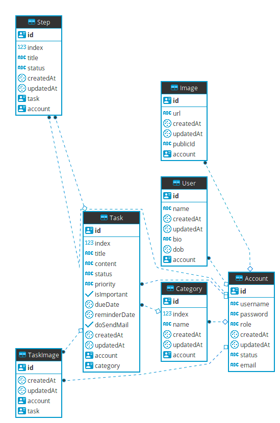

# tick-service

[](https://travis-ci.com/500lab/tick-service)
[](https://stackshare.io/cuongw/tick-service)

📒 Tick's service.


## Features

- Using ESNext
- Setup Babel, ESLint, Prettier, Ava and Husky.
- Having Basic authentication and authorization.
- Setup a basic RESTful API.
- Using Prisma and PostgreSQL.

## Prepare

- [Node](https://nodejs.org/en/)
- [Yarn](https://yarnpkg.com/en/)
- [Docker](https://phoenixnap.com/kb/how-to-install-docker-on-ubuntu-18-04)
- [Docker Compose](https://docs.docker.com/compose/install/)

## Quick start

```shell
$ sudo docker-compose up -d
$ yarn
$ yarn start
```

## Database diagram



Build with 🙌 and ❤️

## License

Apache
